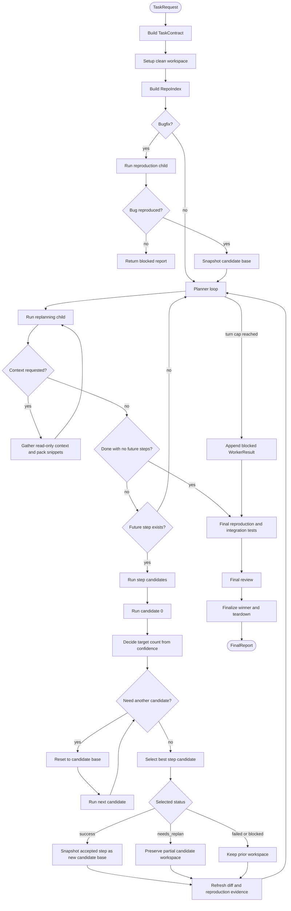

# Durable Agentic Coding Runtime

A workflow-engine-backed coding agent runtime that turns a natural-language coding task into a
reviewed diff. LLMs decide policy, workspace tools and tests provide evidence, and Temporal-Light
keeps the long-running workflow durable.

Temporal-Light is one of my other projects. This repository uses it as the control plane both
because durable orchestration is useful here, and because running a real agent workload against it
helps expose what Temporal-Light needs next.

Detailed project docs:

- [Project plan and architecture](docs/PLAN.md)
- [Getting started](docs/GETTING_STARTED.md)
- [Temporal-Light docs](Temporal-Light/README.md)

## Design Principles

- **Orchestrate evidence, not just agents.** Progress is gated on observed facts: diffs, command
  outputs, test results, reproduction status, and review verdicts. Model narration alone is never
  treated as proof.
- **Workflow engine as control plane.** Durable sequencing, child workflow joins, retries, and
  suspended parent state live in Temporal-Light. Workflow functions stay deterministic; IO happens
  in activities.
- **LLM as policy, tools as ground truth.** The model decides what to inspect, change, and test.
  The workspace, git, and process exit codes decide what actually happened.
- **Incremental replanning.** The planner emits future steps, the runtime executes the first one,
  refreshes evidence, and asks the planner again — rather than blindly executing one large plan.
- **Compact context, external bulk.** Prompt context is deliberately curated. Large outputs are
  written to artifacts and referenced instead of being copied into every prompt.
- **One workspace abstraction.** Host and Docker execution differ only behind the `Workspace`
  command boundary.

## How It Works

The runtime is built from four workflow functions:

- **`main_workflow`** — top-level orchestration: contract, workspace, reproduction, planner turns,
  candidates, and review.
- **`reproduction_workflow`** — for bugfix tasks, finds or creates a command that fails on the
  original bug.
- **`replanning_workflow`** — runs planner turns, gathering grounded context until a concrete next
  step or done state appears.
- **`implementation_workflow`** — executes exactly one plan step in a bounded tool loop and reviews
  its output.

For each planner step, the first candidate runs from the current base; its confidence decides how
many additional candidates to try on fresh branches, and the best candidate by status, confidence,
and passing-test count is snapshotted as the base for later steps. Candidate selection is **per
step**, not whole-run. See [docs/PLAN.md](docs/PLAN.md) for the full architecture, workspace model,
tool surface, and configuration reference.



## Quick Start

```bash
git clone --recurse-submodules https://github.com/BertilBraun/Durable-Agentic-Coding-Runtime.git
cd Durable-Agentic-Coding-Runtime
uv sync --extra dev --extra eval
cp .env.example .env
uv run pytest
```

Run the smoke workflow after setting `LLM_API_KEY` in `.env`:

```bash
(cd Temporal-Light && docker compose up -d)
uv run python -m src.eval.smoke_workflow
```

## Verification

```bash
uv run ruff format src tests
uv run ruff check src tests
uv run pytest -q
```

## Evaluation

- **Smoke workflow** ([`src/eval/smoke_workflow.py`](src/eval/smoke_workflow.py)) creates a small
  temporary git repository, runs `main_workflow` against a live worker with a host origin, and checks
  that a real patch is produced. Run it first, before spending money on SWE-Bench.
- **SWE-Bench Light** ([`src/eval/swe_bench.py`](src/eval/swe_bench.py)) runs the framework against
  SWE-Bench instances with a Docker origin and writes the official `all_preds.jsonl`. Images must be
  built locally first; scoring is most reliable from WSL/Linux.

```bash
uv run --extra eval python -m src.eval.swe_bench --generate-only --force --subset 5
```

### SWE-Bench Light Results

| Date | Dataset         | Split | Subset | Model config | Resolved | Generated patches | Avg cost | Notes |
| ---- | --------------- | ----- | -----: | ------------ | -------: | ----------------: | -------: | ----- |
|      | SWE-Bench Light | test  |        |              |          |                   |          |       |
