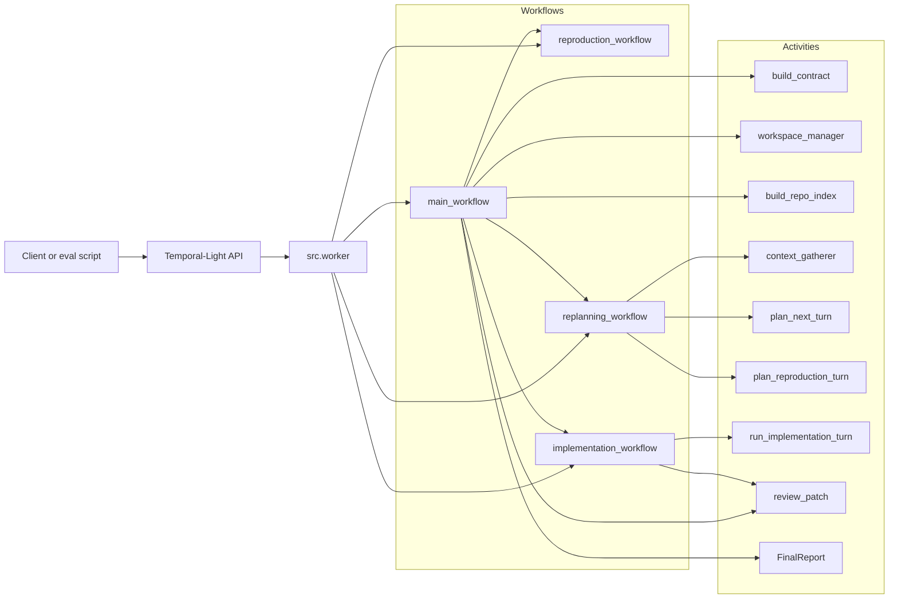
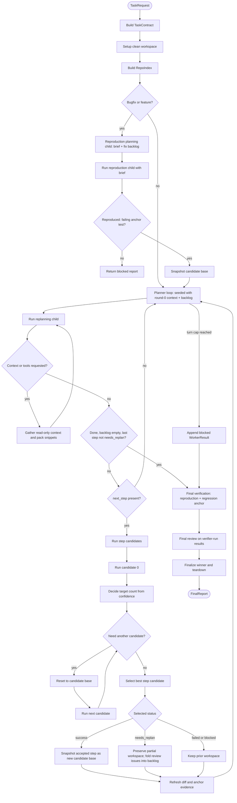
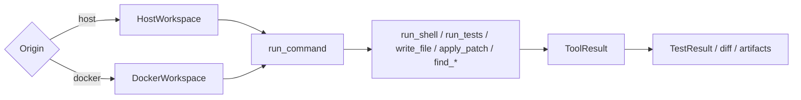

# Project Definition: Durable Agentic Coding Runtime

A durable, evidence-driven runtime that turns a natural-language software task into a reviewed code
change. Temporal-Light is the workflow control plane; LLMs make planning, implementation, and review
decisions; workspace tools and tests are the source of truth. The deliverable is always a diff
against the repository's starting commit.

This document is the detailed as-built map and roadmap. The implementation remains the source of
truth for exact behavior, but this file should be accurate enough for someone to understand the
system without reverse-engineering the workflow code first.

---

## 1. Design Principles

- **Orchestrate evidence, not just agents.** Progress is gated on observed facts: diffs, command
  outputs, test results, reproduction status, and review verdicts. Model narration alone is never
  treated as proof.
- **Workflow engine as control plane.** Durable sequencing, child workflow joins, retries, and
  suspended parent state live in Temporal-Light. Workflow functions remain deterministic; IO happens
  in activities.
- **LLM as policy, tools as ground truth.** The model decides what to inspect, change, and test.
  The workspace, git, and process exit codes decide what actually happened.
- **Incremental (rolling) replanning.** The planner does not emit a large plan that is blindly
  executed. Instead, it emits one concrete `next_step` plus a `remaining_work` backlog; the runtime
  executes that step, refreshes evidence, folds any review feedback back into the backlog, and asks
  the planner again. It only finishes when the backlog is empty and the last step was not revised.
- **Compact context, external bulk.** Prompt context is deliberately curated. Large outputs and
  overflow snippets are written to artifacts and referenced instead of being copied into every prompt.
- **One workspace abstraction.** Host and Docker execution differ only behind the `Workspace`
  command boundary. Workflow logic should not care whether the repository lives on the host or inside
  a container.

## 2. Non-Goals

- Not a chat assistant or IDE plugin. It runs a task to completion under workflow control.
- No front-end/browser automation milestone in the current scope.
- No multi-repo orchestration.
- No long-lived service management inside target repositories.
- No promise of full candidate isolation beyond the git working tree; package installs and global
  environment side effects can still persist inside one run.

---

## 3. Current Architecture



The runtime has four workflow functions:

| Workflow | Responsibility |
| --- | --- |
| [`main_workflow`](../src/workflows/main_workflow.py) | Top-level orchestration. Builds the task contract, prepares the workspace, runs reproduction planning then reproduction, coordinates planner turns, step candidates, final verification, final review, finalization, and teardown. |
| [`reproduction_workflow`](../src/workflows/reproduction_workflow.py) | For bugfix and feature tasks, asks the reproducer to write a failing anchor test (a read/write round trip when the behavior is symmetric) from the planner's `ReproductionBrief`, and to record the existing repo test files that form the regression set. |
| [`replanning_workflow`](../src/workflows/replanning_workflow.py) | Runs planner turns with context gathering and read-only tools. In `mode='reproduction'` (round 0) it emits a `ReproductionPlanTurn` (brief + fix backlog); in `mode='implementation'` it loops until a concrete `next_step` + `remaining_work`, or a done state, is produced. |
| [`implementation_workflow`](../src/workflows/implementation_workflow.py) | Executes exactly one `PlanStep` in a bounded tool loop, reverts unauthorized edits to existing test files, and reviews successful step output against verifier-run test results before returning it to the parent. |

Core modules:

| Concern                                      | Code                                                                                                                                                                                |
| -------------------------------------------- | ----------------------------------------------------------------------------------------------------------------------------------------------------------------------------------- |
| Task input and contract                      | [`models/task.py`](../src/models/task.py), [`activities/contract_builder.py`](../src/activities/contract_builder.py)                                                                |
| Planning state and step schema               | [`models/plan.py`](../src/models/plan.py), [`activities/planner.py`](../src/activities/planner.py)                                                                                  |
| Context gathering and packing                | [`models/context.py`](../src/models/context.py), [`activities/context_gatherer.py`](../src/activities/context_gatherer.py)                                                          |
| Workspace and tools                          | [`activities/workspace_manager.py`](../src/activities/workspace_manager.py), [`tools/definitions.py`](../src/tools/definitions.py), [`tools/handlers.py`](../src/tools/handlers.py) |
| Repository overview and search-backed lookup | [`activities/repo_indexer.py`](../src/activities/repo_indexer.py), [`models/repo.py`](../src/models/repo.py)                                                                        |
| Implementation loop                          | [`activities/implementation.py`](../src/activities/implementation.py), [`workflows/implementation_workflow.py`](../src/workflows/implementation_workflow.py)                        |
| Review and final report                      | [`activities/reviewer.py`](../src/activities/reviewer.py), [`activities/report_builder.py`](../src/activities/report_builder.py)                                                    |
| Candidate confidence helpers                 | [`activities/selector.py`](../src/activities/selector.py)                                                                                                                           |
| LLM client and model routing                 | [`llm/client.py`](../src/llm/client.py), [`config.py`](../src/config.py), [`llm/models.csv`](../src/llm/models.csv)                                                                 |
| Worker registration                          | [`worker.py`](../src/worker.py)                                                                                                                                                     |
| Evaluation                                   | [`eval/smoke_workflow.py`](../src/eval/smoke_workflow.py), [`eval/swe_bench.py`](../src/eval/swe_bench.py)                                                                          |

---

## 4. Workflow Logic



The step-candidate loop is inside `main_workflow`, not a separate selector workflow. For each planner
step:

1. The first candidate runs from the current candidate base.
2. Its confidence determines the target candidate count via `candidate_count_for_confidence`.
3. If more candidates are needed, the workspace resets to the candidate base and tries the same step
   again on a new branch.
4. `_select_step_candidate` chooses the best candidate by status, confidence, passing-test count,
   and earlier candidate index.
5. A successful selected candidate is snapshotted as the new candidate base, so later planner turns
   preserve accepted prior work.

This means candidate selection is **per step**, not whole-run. There is no active candidate combiner
and no final whole-run selector activity.

## 5. Workspace Model



One persistent environment is created per run:

- **Host workspace:** subprocesses run in the user's local repository.
- **Docker workspace:** commands run with `docker exec` in a long-lived container whose working
  directory is the target repository, usually `/testbed` for SWE-Bench.

Setup asserts that the target repository has a clean working tree, records `base_sha`, records the
base branch when available, and uses git branches for candidate attempts. The key state fields are:

| Field | Meaning |
| --- | --- |
| `run_id` | Stable id for the top-level task run. |
| `execution_id` | Per-environment id used to keep child workflow ids unique. |
| `base_sha` | Starting commit. Final diffs are against this commit. |
| `base_branch` | Starting branch if the repository was not detached. |
| `current_branch` | Branch or commit currently checked out. |
| `candidate_base_sha` | Snapshot commit that future candidates should start from. For reproducible tasks this includes the reproduction setup (the anchor test). |

Candidate branches are named `agentic/{run_id}/cand-{index}`. `snapshot_candidate_result` writes a
temporary commit for a candidate result. `snapshot_candidate_base` writes a temporary commit used as
the base for subsequent candidates. `finalize_winner` returns to the original base branch and applies
the winning branch as uncommitted edits, leaving the repository in a familiar "patch ready for
inspection" state.

Important limitation: `reset_to_base` restores git state with `git reset --hard` and `git clean -fd`.
It does not undo external side effects such as package installs, caches, environment mutations, or
system-level writes inside a Docker container.

## 6. Tool Surface

Implementation workers can request:

| Tool | Purpose |
| --- | --- |
| `write_file` | Replace a workspace-relative file with complete content. |
| `write_regression` | Create a new file that must not already exist; used by the reproducer to write the anchor test. |
| `apply_patch` | Apply a git patch from the workspace root. |
| `run_tests` | Run a verification command from a workspace-relative directory. |
| `run_shell` | Run general shell commands for inspection or setup. |
| `find_definition` | Search for Python definitions by name. |
| `find_callers` | Search for symbol mentions/calls by name. |
| `find_callees` | Search call-like expressions in a file. |
| `gather_context` | Delegate focused read-only context retrieval to the context gatherer. |

The reproducer's tool set excludes `write_file` and `apply_patch` so the anchor test can only be
created through `write_regression`. During implementation, edits to existing test files are detected
after each tool call and reverted (the reproduction anchor file is the only permitted test edit).

The `find_*` tools are currently search-backed, not precise semantic index lookups. `RepoIndex`
contains model types for symbols and references, but `build_repo_index` currently returns a bounded
file tree/overview and leaves symbol/reference lists empty. That is an intentional simplification in
the active code after pruning stale claims about tree-sitter indexing.

Tool path inputs are validated to prevent absolute paths and parent traversal. Large stdout/stderr is
compacted in the immediate `ToolResult` and written to artifacts under `ARTIFACTS_ROOT`.

---

## 7. Temporal-Light Role

Temporal-Light is one of my other projects. Here it provides durable execution for a workflow that
can spend a long time waiting on LLM calls, subprocesses, child workflows, and external services.

In this repository, Temporal-Light is used for:

- durable parent workflow state;
- activity execution and replay;
- child workflows for reproduction, replanning, and implementation;
- parent suspension while waiting for child workflow results;
- JSON-serializable workflow inputs and outputs.

Workflow functions should stay deterministic. IO, randomness, wall-clock access, Docker, git,
subprocesses, and LLM calls belong in activities. For Temporal-Light internals, use the dedicated
docs in [`../Temporal-Light/README.md`](../Temporal-Light/README.md),
[`../Temporal-Light/documentation/FUTURE.md`](../Temporal-Light/documentation/FUTURE.md), and
[`../Temporal-Light/documentation/PERFORMANCE.md`](../Temporal-Light/documentation/PERFORMANCE.md).

---

## 8. Evaluation

### Smoke Workflow

[`src/eval/smoke_workflow.py`](../src/eval/smoke_workflow.py) creates a small temporary git
repository, starts a live worker against Temporal-Light, runs `main_workflow` with a host origin, and
checks that a real patch is produced. It is the first live end-to-end test to run before spending
money on SWE-Bench.

### SWE-Bench Light

[`src/eval/swe_bench.py`](../src/eval/swe_bench.py) runs the framework against SWE-Bench instances:

1. Load Python rows from the configured dataset and split.
2. Verify required Docker images exist locally before starting workflows.
3. Start `main_workflow` with a Docker origin for each pending instance.
4. Write one sidecar JSON record per instance.
5. Write the official `all_preds.jsonl` file.
6. Optionally run the official SWE-Bench harness.

SWE-Bench Docker images must be built locally before generation. Native Windows can run generation
against Docker Desktop, but image preparation and official scoring are usually more reliable from
WSL/Linux because the SWE-Bench harness imports Unix-oriented modules.

### Future Comparison Strategy

This project does not currently claim a SWE-Bench score. Exploratory SWE-Bench runs are useful for
debugging the runtime, but they are not meaningful benchmark results without a paired baseline.

A useful future evaluation would compare:

- the base model in a lightweight SWE-agent-style harness;
- the same model in this durable workflow runtime.

Use a fixed task subset and report:

- resolved/attempted;
- generated patches;
- average cost;
- input, output, and cache-read tokens;
- wall-clock time;
- qualitative failure modes.

The expected advantages of this runtime are durability, Temporal-Light dashboard introspection,
hard verification gates, deterministic orchestration around tests and reviews, explicit reset logic,
protection against test overrides, multi-model routing, curated context gathering, and inspectable
planner steps.

The expected tradeoffs are higher token usage and more constraint. A free-looping mini agent may be
more flexible and outperform it on some individual tasks, but it has fewer structural safeguards
against broken tests, forgotten context, skipped review, or untracked decision drift.

---

## 9. Configuration

Settings load from environment variables in [`src/config.py`](../src/config.py), with model metadata
from [`src/llm/models.csv`](../src/llm/models.csv).

Key variables:

| Variable                                  | Purpose                                                                   |
| ----------------------------------------- | ------------------------------------------------------------------------- |
| `LLM_API_KEY`                             | API key for the configured LLM endpoint.                                  |
| `LLM_BASE_URL`                            | OpenAI-compatible endpoint.                                               |
| `MODEL_CONTRACT_BUILDER`                  | Model for task contract generation.                                       |
| `MODEL_PLANNER`                           | Model for planner turns.                                                  |
| `MODEL_CONTEXT_GATHERER`                  | Model for context gathering.                                              |
| `MODEL_REPRODUCER`                        | Model for bug reproduction.                                               |
| `MODEL_IMPLEMENTATION`                    | Model for implementation worker turns.                                    |
| `MODEL_REVIEWER`                          | Model for step/final review and SWE-Bench patch comparison.               |
| `REASONING_EFFORT_CONTRACT_BUILDER`       | Reasoning effort for contract generation, when supported by the endpoint. |
| `REASONING_EFFORT_PLANNER`                | Reasoning effort for planning, when supported by the endpoint.            |
| `CLEANUP_CANDIDATE_BRANCHES`              | Whether candidate branches are deleted during finalization.               |
| `IMPLEMENTATION_MAX_TOOL_ROUNDS`          | Max LLM/tool loop rounds for one implementation step.                     |
| `REPRODUCER_MAX_TOOL_ROUNDS`              | Max LLM/tool loop rounds for reproduction.                                |
| `MAX_PLANNER_TURNS`                       | Top-level cap on planner turns.                                           |
| `CANDIDATE_COUNT_MEDIUM_CONFIDENCE`       | Step candidate count for medium confidence first attempts.                |
| `CANDIDATE_COUNT_LOW_CONFIDENCE`          | Step candidate count for low confidence first attempts.                   |
| `CONTEXT_GATHERER_MAX_TOOL_CALLS`         | Max tool calls in one context gathering request.                          |
| `CONTEXT_UTILIZATION_STOP_THRESHOLD`      | Soft prompt-context cutoff.                                               |
| `CONTEXT_UTILIZATION_HARD_STOP_THRESHOLD` | Hard prompt-context cutoff that spills observations to artifacts.         |
| `TOOL_OUTPUT_MAX_CHARACTERS`              | Output size before artifact spill.                                        |
| `CONTEXT_PACK_MAX_CHARACTERS`             | Packed snippet character budget.                                          |

The config intentionally no longer exposes dormant knobs for human approval, plan review,
complexity assessment, summarization, or an old replan loop.

---

## 10. Current State And Known Gaps

Implemented and covered by unit/fake-mode tests:

- host and Docker workspace abstractions;
- contract builder;
- repository overview;
- reproduction planning (round 0) producing a `ReproductionBrief` + fix backlog;
- reproduction workflow for bugfix and feature tasks, writing a round-trip anchor test via
  `write_regression` plus a regression test set;
- assert-count gate (an anchor test with no assertion does not count as reproduced);
- rolling replanning workflow with context gathering, `next_step` + `remaining_work` backlog, and
  review feedback folded back into the backlog;
- implementation child workflow with bounded tools and deterministic test-file write protection;
- review of successful steps against verifier-run test results;
- adaptive per-step candidates;
- final verification against the reproduction + regression anchor;
- final report and SWE-Bench prediction writing.

Known gaps:

- **Docker failure cleanup is incomplete.** `teardown_environment` runs on normal completion/blocked
  returns, but failures and cancellation need better compensation support from Temporal-Light.
- **Candidate isolation is git-tree isolation.** `reset_to_base` does not recreate the environment.
- **Search-backed lookup is imprecise.** `find_definition`, `find_callers`, and `find_callees` are
  pragmatic search tools, not scope-aware analyzers yet.
- **Final `Plan` reporting is thin.** The runtime is planner-turn driven; `FinalReport.plan` is a
  compatibility/reporting object rather than a full original plan.

## 11. Roadmap

Near-term:

1. Decide whether search-backed `find_*` is sufficient or implement a real Python symbol/reference
   index.
2. Improve cleanup on workflow failure/cancellation when Temporal-Light supports the right
   compensation hooks.
3. Add a candidate combiner instead of just selecting the best candidate per step. This would allow us to merge non-conflicting
   candidates and preserve more of the model's work.

Deferred:

- stronger Docker candidate isolation;
- richer observability and cost reporting;
- precise per-language code intelligence.

---

## 12. Local Commands

Install and test:

```bash
uv sync --extra dev --extra eval
uv run ruff format src tests
uv run ruff check src tests
uv run pytest -q
```

Run host-workspace integration tests:

```bash
RUN_HOST_TESTS=1 uv run pytest tests/test_workspace_manager_integration.py -q
```

Start Temporal-Light and run smoke:

```bash
(cd Temporal-Light && docker compose up -d)
uv run python -m src.eval.smoke_workflow
```

Run on SWE-Bench Light:

```bash
uv run --extra eval python -m src.eval.swe_bench --generate-only --force --subset 5
```
